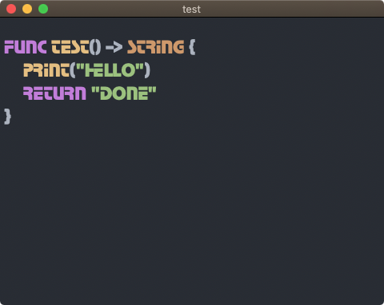
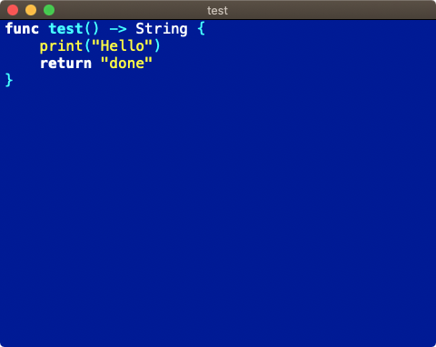
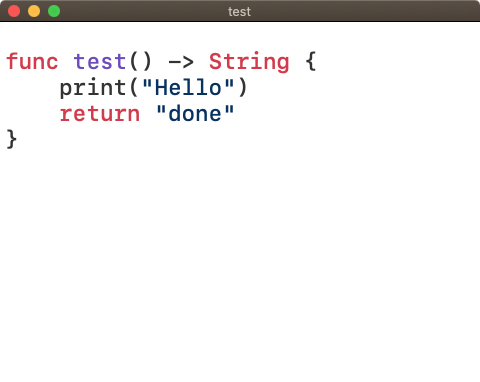

# HighlighterSwift 1.1.6

This library provides a Swift wrapper for the popular [Highlight.js](https://highlightjs.org/) code highlighting utility.



It is a more up-to-date version of Juan Pablo Illanes’ [Highlightr](https://github.com/raspu/Highlightr) and relies heavily upon code from that project, which is unfortunately no longer fully maintained.

### Improvements and Changes

*Highlightr* makes use of *Highlight.js 9.13.4*, but the most recent release of the JavaScript library is 11.9.0. This is the version used by **HighlighterSwift**. Earlier versions of *Highlight.js* are not considered secure.

**HighlighterSwift** adds support for alpha values in CSS colours, eg. `#808080AA`, not present in Highlightr.

Unlike *Highlightr*, **HighlighterSwift** parses *Highlight.js* themes for separate declarations of the same style. For example, *Hybrid* contains the following CSS:

```css
.hljs{display:block;overflow-x:auto;padding:.5em;background:#1d1f21}.hljs span::selection,.hljs::selection{background:#373b41}.hljs{color:#c5c8c6}
```

The `hljs.color` attribute is added to `hljs.display`, `hljs.overflow-x`, `hljs.padding` and `hljs.background`, it doesn’t replace them.

**HighlighterSwift** was designed from the ground up as a Swift Package. Support for legacy package managers is not included. *Highlightr* supports CocoaPods and Carthage.

**HighlighterSwift** is more deeply commented and the code is presented in a more consistent style.

A number of functions have been given extra parameters, primarily to add font selection when setting themes and initiating *Theme* objects. Redundant code has been removed. Some parameters have been renamed.

Unit tests have been added, and more will come, I hope.



#### Why not update Highlightr?

**HighlighterSwift** was created to meet the needs of a specific project, which was originally conceived with a modified version *Hightlightr* in mind. Some of the changes listed above are breaking, and so I feel it’s not appropriate to just inflict them on the *Hightlightr* source, especially when there are many outstanding pull requests yet to be addressed. But I’m not opposed to pulling in my changes if the community requests that.

**HighlighterSwift** is released under the same [licence](#licence) as *Highlightr*, allowing developers to select either, both or a mix of the two.

## Platform Support

**HighlighterSwift** supports macOS 10.14 and up, and iOS 12 and up. iOS support is untested, however.

## Installation

To add **HighlighterSwift** to your project, use Xcode to add it as a Swift Package at this repo’s URL. The library contains the *Highlight.js* code and themes.

**Note** This project was begun to support another, so some themes have been modified slightly to meet the needs of that other project. For example, background images have been removed from the Brown Paper, Greyscale, Schoolbook and Pojoacque themes (*Highlight.js* is also starting to do this); the two Kimbies have been renamed for consistency; colours have been formalised as hex values.

## Usage

Instantiate a *Highlighter* object. Its `init()` function returns an optional, which will be `nil` if the `Highlight.min.js` file could not be found or is non-functional, or the `Default` theme CSS file is missing:

```swift
if let highlighter: Highlighter = Highlighter.init() {
    ...
}
```

You can set a specific theme using the `setTheme()` function:

```swift
highlighter.setTheme("atom-one-light")
```

You can apply your chosen font at this time too rather than fall back on the default, 14pt Courier:

```swift
highlighter.setTheme("atom-one-light", withFont: "Menlo-Regular", ofSize: 16.0)
```

From 1.1.3, you can also specify a line spacing value:

```swift
highlighter.theme.lineSpacing = (self.lineSpacing - 1.0) * self.fontSize
```

and/or a paragraph spacing value:

```swift
highlighter.theme.paraSpacing = 1.0
```

A value of zero for `lineSpacing` is equivalent to single spacing. `paraSpacing` is the space in points added at the end of the paragraph — use `0.0` for no additional spacing (the default).

Both values must be non-negative. Negative values be replaced with default valyes: `0.0` in both cases.

**Note** These new values are applied to the instance’s `theme` property.

You can set or change your preferred font later by using `setCodeFont()`, which takes an *NSFont* or *UIFont* instance configured for the font and text size you want, and is called on the *Highlighter* instance’s `theme` property:

```swift
let font: NSFont = NSFont.init(name: "Menlo-Regular", size: 12.0)!
highlighter.theme.setCodeFont(font)
```

Finally, get an optional *NSAttributedString* containing the formatted code:

```swift
if let displayString: NSAttributedString = highlighter.highlight(codeString, as: "swift") {
    myTextView.textStorage!.addAttributedString(displayString)
}
```



The second parameter is the name of language you’re rendering. If you leave out this parameter, or pass `nil`, *Highlighter* will use *Highlight.js*’ language detection feature.

You can get a list of supported languages by the name they are known to *Highlight.js* by calling `supportedLanguages()` — it returns an array of strings.

The function `availableThemes()` returns a list of the installed themes.

## Release Notes

- 1.1.6 *30 August 2024*
    - Update to the latest version of Highlight.js 11.9.0.
- 1.1.5 *29 April 2024*
    - Add dark GitHub theme.
- 1.1.4 *10 November 2023*
    - Update to Highlight.js 11.9.0.
    - Fix: add missing iOS-oriented import (thanks [@greggreg](https://github.com/gregggreg))
- 1.1.3 *16 May 2023*
    - Add line and paragraph spacing controls.
- 1.1.2 *15 March 2023*
    - Include missing languages.
- 1.1.1 *14 March 2023*
    - Update to Highlight.js 11.7.0.
- 1.1.0 *26 April 2022*
    - Update to Highlight.js 11.5.0.
    - Include all Highlight.js languages.
- 1.0.1 *23 July 2021*
    - Correct list of available themes in `package.swift`.
- 1.0.0 *15 July 2021*
    - Initial public release.

## Licences

**HighlighterSwift**, like *Highlightr* before it, is released under the terms of the MIT Licence. *Hightlight.js* is released under the BSD 3-Clause Licence.

**HighlighterSwift** is &copy; 2024, Tony Smith. Portions are &copy; 2016, Juan Pablo Illanes. Other portions are &copy; 2006-2024, Josh Goebel and other contributors.
