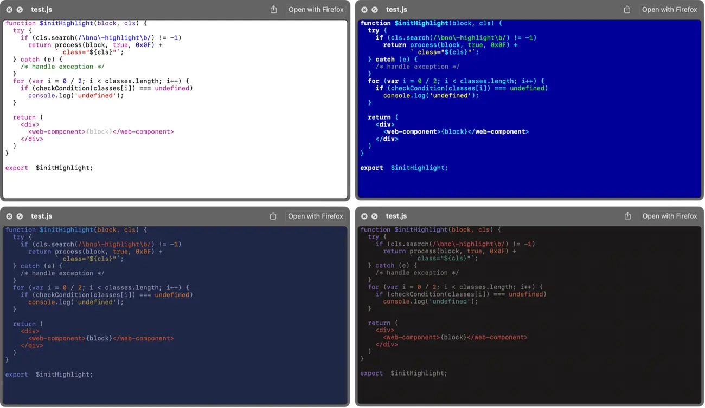

# HighlighterSwift 2.0.1

This library provides a Swift wrapper for the popular [Highlight.js](https://highlightjs.org/) code highlighting utility.



**HighlighterSwift** is a more up-to-date version of Juan Pablo Illanes’ [Highlightr](https://github.com/raspu/Highlightr), which is unfortunately no longer fully maintained. **HighlighterSwift** was created to meet the needs of a specific project which required a modified version Hightlightr. These modifications expanded into bringing the whole codebase up to date and involved some structural and formatting changes. Hence the new repo.

## Potential Breaking Changes with 2.0.0

* Minimum supported macOS version is now Big Sur (11).
* Minimum supported Swift version is now 5.9.
* Access rules for many module components have been changed from `open` to `public`.

## Non-breaking Changes with 2.0.0

* Optionally, present highlighted code with line numbers.

## HighlighterSwift vs Highlightr

**HighlighterSwift**:

* Uses the most recent release of *Highlight.js*, 11.11.1.
* Provides support for alpha values in CSS colours, eg. `#808080AA`. It also parses *Highlight.js* themes for separate declarations of the same style.
* Has been designed from the ground up as a Swift Package. Support for legacy package managers is not included.
* Is more deeply commented and the code is presented in a more consistent style than its predecessor.
* Extends a number of functions with extra parameters, primarily to add font selection when setting themes and initializing *Theme* objects.
* Renames some method parameters for clarity.
* Redundant code has been removed.
* Gains unit tests, with more to come, I hope.

## Platform Support

**HighlighterSwift** supports macOS 11 (Big Sur) and up, iOS (iPadOS) 12 and up, tvOS 12 and up, and visionOS 1 and up. iOS, tvOS and visionOS support remains untested, however. If you use **HighlighterSwift** with these operating systems and run into issues, please let me know.

## Installation

To add **HighlighterSwift** to your project, add it as a Swift Package with this repo’s URL.

The library contains the *Highlight.js* code and themes, but please note that some themes have been modified slightly to meet the needs of the project **HighlighterSwift** was originally developed for. Specifically:

* Background images have been removed from the Brown Paper, Greyscale, Schoolbook and Pojoacque themes (*Highlight.js* is also starting to do this)
* The two Kimbie themes have been renamed for consistency.
* All colours have been formalized as hex values.

## Usage

Instantiate a *Highlighter* object. Its `init()` function returns an optional, which will be `nil` if the `Highlight.min.js` file could not be found or is non-functional, or the `Default` theme CSS file is missing:

```swift
if let highlighter = Highlighter() {
    ...
}
```

You can now set a specific theme using the `setTheme()` function:

```swift
highlighter.setTheme("atom-one-light")
```

You can also apply your chosen font at this time too rather than fall back on the default, 14pt Courier:

```swift
highlighter.setTheme("atom-one-light", withFont: "Menlo-Regular", ofSize: 16.0)
```

Having set the theme, you can now specify a line spacing value:

```swift
highlighter.theme.lineSpacing = self.lineSpacing * self.fontSize
```

and/or a paragraph spacing value:

```swift
highlighter.theme.paraSpacing = 1.0
```

A value of `0.0` for `lineSpacing` is equivalent to single spacing. `paraSpacing` is the space in points added at the end of the paragraph — use `0.0` for no additional spacing (the default).

Both values must be non-negative. Negative values be replaced with the default values.

**Note** As shown above, these new values are applied to the `Highlighter` instance’s `theme` property.

You can set or change your preferred font later by using `setCodeFont()`, which takes an *NSFont* or *UIFont* instance configured for the font and text size you want, and is called on the *Highlighter* instance’s `theme` property:

```swift
NSFont font = NSFont(name: "Menlo-Regular", size: 12.0) ?? NSFont.systemFont(ofSize: 12.0)
highlighter.theme.setCodeFont(font)
```

Finally, get an optional *NSAttributedString* containing the formatted code:

```swift
if let displayString: NSAttributedString = highlighter.highlight(codeString, as: "swift") {
    myTextView.textStorage!.addAttributedString(displayString)
}
```

The second parameter is the name of language you’re rendering. If you leave out this parameter, or pass `nil`, **HighlighterSwift** will use the language detection feature built into *Highlight.js*.

From 2.0.0, pass in a fourth parameter, an instance of a `LineNumberingData` structure, to instruct **HighlighterSwift** to add line numbers to the code according to the values included in this data. The default for this parameter is `nil` (don’t add line numbers).

```swift
public struct LineNumberData {

    public var numberStart: Int = 1
    public var minWidth: Int = 2
    public var separator: String = "  "
    public var usingDarkTheme: Bool = false
    public var lineBreak: String = "\n"
    public var fontSize: CGFloat = 16.0
}
```

`LineNumberingData` properties allow you to specify:

* The initial line number of the rendered code. Default: 1.
* The minimum number of digits in the line number. Default: 2. This will always be overridden by the maximum line number. For example, if you set this to 3 (so the first line might be rendered as `001`) but there are a thousand or more lines in the code, the first line will be rendered as `0001`.
* A separator string to be placed between the line number and the line itself. Default: two spaces.
* Is the theme you are using dark? Default: `false`.
* The line-break string used in the tokenized source code. Default: `\n`. **Note** You should not need to change this.
* The size of the line number font. Typically this will match your code font’s size. Default: 16.0 points.

All these values are optional.

Use this feature in this way:

```swift
var lineNumberingData = LineNumberData()
lineNumberingData.minWidth = 4
lineNumberingData.numberStart = 100
lineNumberingData.usingDarkTheme = !isMacInLightMode()
lineNumberingData.fontSize = self.settings.fontSize

if let displayString: NSAttributedString = highlighter.highlight(codeString, as: "swift", lineNumbering: lineNumberingData) {
    myTextView.textStorage!.addAttributedString(displayString)
}
```

You can get a list of supported languages by the name they are known to *Highlight.js* by calling `supportedLanguages()` — it returns an array of strings.

The function `availableThemes()` returns a list of the installed themes.

## Release Notes

Please see [CHANGELOG.md](CHANGELOG.md).

## Licences

**HighlighterSwift**, like *Highlightr*, is released under the terms of the MIT Licence. *Hightlight.js* is released under the BSD 3-Clause Licence.

**HighlighterSwift** is &copy; 2026, Tony Smith. Portions are &copy; 2016, Juan Pablo Illanes. Other portions are &copy; 2006-2026, Josh Goebel and other contributors.
